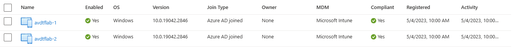

# terraform-azurerm-avd-aad

This lab deploys an Azure Virtual Desktop demo scenario with the following elements:

- A workspace
- An Application Group of type Desktop
- A Host Pool with two session hosts, Azure AD Joined and auto-enrolled into MDM (Intune).

Code is mainly based on Microsoft's document [Configure Azure Virtual Desktop session hosts using Terraform](https://learn.microsoft.com/en-us/azure/developer/terraform/create-avd-session-host), with addings based on the following documents:

- [Deploy Azure AD-joined virtual machines in Azure Virtual Desktop](https://learn.microsoft.com/en-us/azure/virtual-desktop/azure-ad-joined-session-hosts#deploy-azure-ad-joined-vms)
- [Enrolling Terraform Deployed AVD Session Hosts into Intune](https://virtuallyflatfeet.com/2022/06/07/enrolling-terraform-deployed-avd-session-hosts-into-intune/)
- [How to join Azure AD automated](https://www.rozemuller.com/how-to-join-azure-ad-automated/)
- [AAD joined AVD - SessionHost is not joined to a domain](https://learn.microsoft.com/en-us/answers/questions/489676/aad-joined-avd-sessionhost-is-not-joined-to-a-doma)
- [Azure AD joined and DomainJoinedCheck failed](https://techcommunity.microsoft.com/t5/azure-virtual-desktop/azure-ad-joined-and-domainjoinedcheck-faild/m-p/2565889)

Some considerations:
- MDM must be enabled in advance. See [Automatic MDM enrollment in the Intune admin center](https://learn.microsoft.com/en-us/windows/client-management/azure-ad-and-microsoft-intune-automatic-mdm-enrollment-in-the-new-portal) for reference.